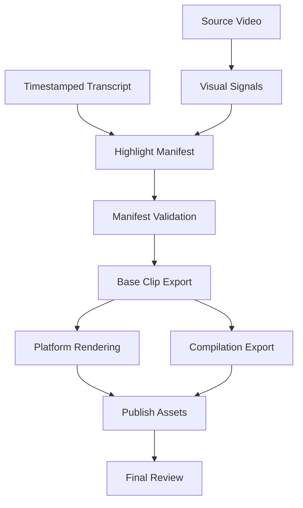

# 自动剪辑高光视频 Skill 设计

## 背景

当前目录用于创建一个可审阅、可发布的 Codex skill 源码包。目标是让 Codex 在处理长视频、播客、课程、访谈、讲座和直播回放时，能借助 AI 分析找出适合独立发布的高光片段，并用本地脚本稳定导出短视频资产。

第一版已经建立“AI 编辑判断 + 结构化 JSON 清单 + 本地 `ffmpeg` 执行”的主线。二期扩展在这个主线之上增加成片包装能力：字幕与竖屏输出、多模态画面信号、合集视频导出、平台发布资产建议。

## 范围

### 第一版基础能力

第一版采用“AI 决策 + 本地剪辑执行”的方案。

包含：

- 针对长视频、播客、课程、访谈类素材的高光识别流程。
- 以转写文本为主要分析输入，必要时结合视频元数据和人工提供的上下文。
- 输出多个独立高光短片，默认每段 30-90 秒。
- 使用结构化 JSON 保存高光决策，包含时间码、标题、理由、风险和剪辑建议。
- 提供本地脚本校验高光清单并调用 `ffmpeg` 批量导出片段。

### 二期扩展能力

二期在第一版导出的高光片段基础上，增加面向发布和复核的后处理能力。

包含：

- 字幕与竖屏输出：支持 burned subtitles、9:16、1:1、16:9 输出配置，以及清晰的裁切和字幕策略。
- 多模态辅助判断：通过抽帧、场景变化、黑屏、幻灯片、人物画面等视觉信号辅助高光选择和质量复核。
- 合集视频导出：将多个高光片段按清单顺序或评分策略拼接成 compilation。
- 平台发布资产：为 Shorts、TikTok、Reels、Bilibili、微信视频号等平台生成标题、简介、标签、字幕策略和发布包清单。

### 明确不包含

- 不直接内置云端 API 调用或强绑定某个模型供应商。
- 不自动发布到任何平台；二期只生成可人工审阅的发布资产。
- 不自动生成最终封面图；可以给出封面建议和候选时间点。
- 不把画面信号作为唯一依据来决定高光，带时间戳转写仍是主要证据。
- 不以游戏、赛事、纯画面集锦作为主场景；这些可以作为未来独立方向设计。
- 不在二期强制实现自动语音转写；skill 可继续指导用户提供或生成带时间戳转写。

## Skill 触发条件

技能名称使用 `auto-highlight-video`。

触发描述应覆盖这些场景：

- 用户要求自动剪辑、找高光、提取精彩片段、生成 clips、从长视频做短视频。
- 输入是长视频、播客、课程、访谈、讲座、直播回放等语义内容较强的视频。
- 用户希望 AI 帮忙挑选片段，并最终能用本地工具导出多个短片。
- 用户要求生成带字幕、竖屏版、合集版或平台发布文案的短视频交付包。
- 用户希望结合画面变化、人物出现、幻灯片、黑屏或视觉节奏来复核高光质量。

## 文件结构

第一版已存在的核心结构：

```text
.
├── SKILL.md
├── references/
│   └── highlight-schema.md
└── scripts/
    ├── export_clips.py
    └── validate_highlights.py
```

二期可新增的结构：

```text
.
├── references/
│   ├── platform-presets.md
│   ├── quality-review.md
│   └── phase2-output-schema.md
└── scripts/
    ├── analyze_visual_signals.py
    ├── export_compilation.py
    ├── render_platform_clips.py
    └── generate_publish_assets.py
```

二期脚本应保持单一职责：视觉分析只产出结构化信号，平台渲染只处理输出规格，合集导出只拼接已验证片段，发布资产生成只产出文本和清单，不直接上传。

## 核心工作流

1. 确认输入
   - 获取视频路径。
   - 检查是否已有转写文件。
   - 如果没有转写，要求先生成转写，或说明可接受的转写格式。
   - 如果用户要求平台输出，确认目标平台、比例、字幕语言和是否需要合集。

2. 收集元数据
   - 使用 `ffprobe` 获取时长、分辨率、帧率、音频轨道。
   - 检查视频文件是否存在、是否可由 `ffmpeg` 读取。
   - 判断源视频是横屏、竖屏、方形还是混合素材。

3. 分析转写
   - 读取带时间码的转写。
   - 找出可独立理解的片段，而不是依赖大量上下文的断句。
   - 优先选择强观点、清晰解释、故事转折、情绪峰值、知识密度高、可形成标题的内容。

4. 生成候选高光
   - 每个片段包含 `id`、`title`、`start`、`end`、`score`、`reason`、`risk`、`edit_notes`。
   - 默认片段时长 30-90 秒。
   - 片段之间尽量不重叠。
   - 为每个片段预留少量前后缓冲，避免切掉句首句尾。

5. 校验清单
   - 使用 `scripts/validate_highlights.py` 校验字段、时间范围、片段时长、重叠和重复 `id`。
   - 校验失败时，Codex 应修正 JSON，而不是直接导出。

6. 复核片段边界
   - 如果存在 VTT 转写，使用 `scripts/review_clip_boundaries.py` 检查起止点是否切入字幕 cue。
   - 边界复核失败时，调整到自然句子、停顿或说话人切换处。

7. 导出基础短片
   - 使用 `scripts/export_clips.py` 读取清单并调用 `ffmpeg`。
   - 默认导出多个独立片段到输出目录。
   - 导出文件名使用安全的 `id` 和标题片段。

8. 执行二期后处理
   - 如果用户要求字幕或平台规格，执行平台渲染工作流。
   - 如果用户要求合集，执行合集导出工作流。
   - 如果用户要求发布包，生成标题、简介、标签和交付清单。

9. 最终质量复核
   - 使用 `ffprobe` 确认输出文件时长、分辨率、音视频流。
   - 对平台版检查比例、字幕可读性、安全区和音画同步。
   - 对合集版检查片段顺序、转场、响度和结尾完整性。

## 边界与数据流

第一版核心路径保持不变：`transcript -> highlight manifest -> validation -> export -> verification`。二期扩展只围绕已验证的 manifest 和导出片段做增强，不绕过清单校验，也不让平台包装逻辑反向改变原始高光判断。



数据边界：

- `highlight manifest` 保存编辑决策，是后续导出和包装的主契约。
- `visual signals` 只记录辅助证据和风险提示，不直接生成最终切点。
- `platform rendering` 只改变输出比例、字幕、编码和包装形式，不改变片段语义。
- `publish assets` 只生成可审阅文本和清单，不执行上传、排期或平台 API 写操作。

## 二期扩展工作流

### 字幕与竖屏输出

输入：

- 已通过校验的高光清单。
- 源视频或第一版导出的基础短片。
- 可用于字幕的 SRT、VTT、JSON 转写，或从清理后的字幕生成的文本片段。
- 平台输出配置，例如 9:16、1:1、16:9、字幕语言、字体大小、字幕位置、安全区。

输出：

- 平台规格视频文件，例如 `clip-01_vertical.mp4`、`clip-01_square.mp4`。
- 字幕策略说明，记录是否 burned subtitles、字幕来源、样式和不可自动保证的限制。
- 渲染清单，记录每个输出文件的比例、分辨率、编码和源片段。

规则：

- 默认不改变原始语义内容，只调整画面比例、字幕和编码。
- 竖屏裁切应优先保留主体人物、幻灯片重点区域或用户指定区域。
- 当主体位置无法从自动规则可靠判断时，使用居中裁切并在风险中说明。
- 字幕应避免遮挡人脸、关键幻灯片文字和平台按钮安全区。
- 若字幕行太长，应优先换行、缩短每行字符数或调整字号，不应删改原意。

### 多模态辅助判断

输入：

- 源视频。
- 已验证或候选状态的高光清单。
- 可选抽帧间隔、场景变化阈值和片段复核范围。

输出：

- 视觉信号报告，包含每个候选片段的抽帧摘要、场景变化、黑屏、静态幻灯片、人物画面和明显异常。
- 写回 `edit_notes` 或独立 review report 的质量建议。

规则：

- 多模态信号用于辅助，而不是替代转写分析。
- 如果转写高分但画面长期黑屏、无关幻灯片或画面明显异常，应提升人工复核优先级。
- 如果转写内容依赖屏幕演示、图表或代码画面，应在 `risk` 中说明观看者是否需要画面上下文。
- 抽帧频率应可配置，默认以低成本方式覆盖候选片段，不对全视频做昂贵分析。

### 合集视频导出

输入：

- 已导出的基础短片或平台规格短片。
- 高光清单中的顺序、评分或用户指定排序。
- 可选片头、片尾、转场时长、统一响度和合集标题。

输出：

- 一个 compilation 视频文件。
- 一个 compilation manifest，记录包含的 clip id、顺序、起止位置、转场和总时长。

规则：

- 默认按高光清单顺序拼接，用户也可以指定按评分、主题或叙事顺序排序。
- 拼接前应确保所有输入片段编码、分辨率和音频参数兼容；不兼容时统一重编码。
- 转场应保持简单，默认硬切或短淡入淡出，不引入复杂视觉效果。
- 合集应保留每个片段的完整含义，不应为了节奏删减句子中段。

### 平台发布资产

输入：

- 高光清单。
- 已导出的短片或合集文件。
- 目标平台和受众。
- 可选用户品牌语气、禁用词、主题偏好。

输出：

- 每个片段的候选标题、简介、标签、短 caption 和推荐发布平台。
- 发布包清单，记录视频文件、字幕文件、manifest、风险提示和人工确认项。
- 封面建议，使用时间点和画面描述表达，不自动生成封面图片。

规则：

- 文案必须忠实于片段内容，不夸大、不制造虚假冲突、不改变说话人立场。
- 平台标题应优先清晰和可搜索，其次才是吸引点击。
- 标签应与内容和平台习惯相关，避免堆砌。
- 对隐私、版权、医疗、金融、法律或敏感内容，应生成更保守的文案并标记人工审阅。

## 高光评分标准

每个候选片段按 1-10 分评分。推荐导出的片段通常应为 7 分以上。

评分考虑：

- 独立性：不依赖前文也能理解。
- 信息密度：单位时间内有明确观点、方法、故事或结论。
- 开场吸引力：前 5-10 秒能让观众知道为什么要继续看。
- 完整性：片段包含自然的起承转合或完整解释。
- 可发布性：没有明显隐私、版权、冒犯性、断章取义风险。
- 剪辑可行性：时间码附近有自然停顿，适合切分。
- 画面可用性：画面、字幕、主体位置和视觉节奏支持发布，而不是削弱片段质量。

## 数据契约

第一版高光清单继续遵循 `references/highlight-schema.md`，并保持 `highlights` 作为导出短片的唯一必需数组。

二期可在不破坏第一版清单的前提下增加可选字段：

- `output_profiles`：目标平台、比例、分辨率、字幕策略、编码策略。
- `visual_review`：抽帧摘要、异常画面、画面依赖风险。
- `compilations`：合集名称、片段顺序、转场和输出文件名。
- `publish_assets`：标题、简介、标签、封面建议和人工审阅项。

第一版校验脚本不应因为缺少这些二期字段而失败。二期字段需要独立校验器或扩展校验模式，以避免影响基础剪辑流程。

## 错误处理

### 第一版错误处理

- 缺少视频文件：明确指出路径不存在，并要求用户提供正确路径。
- 缺少转写：给出所需格式，并暂停高光选择。
- 转写无时间码：说明无法可靠导出，要求补充时间码或接受人工估算。
- `ffmpeg` 或 `ffprobe` 不可用：提示安装或让用户提供可用命令路径。
- 高光清单无效：运行校验脚本并根据错误修正 JSON。
- 导出失败：保留失败命令和 stderr 摘要，逐个片段定位问题。

### 二期错误处理

- 字幕文件缺失或时间轴不匹配：停止字幕烧录，要求提供正确字幕，或退回无字幕输出。
- 字幕渲染失败：保留失败命令、字体路径、字幕文件路径和 stderr 摘要。
- 竖屏裁切无法自动判断主体：使用保守居中裁切，并在发布包风险中标记需要人工复核。
- 源片段编码不一致导致合集失败：先统一重编码，再重新拼接。
- 多模态抽帧失败：不阻塞基础高光导出，但必须说明视觉复核缺失。
- 平台资产生成存在敏感风险：降低文案强度，标记人工审核，不自动生成夸张标题。

## 测试与验证

### 第一版验证目标

- `validate_highlights.py` 能拒绝缺字段、非法时间码、过短/过长片段、重叠片段和重复 `id`。
- `validate_highlights.py` 能接受合法清单。
- `export_clips.py --dry-run` 能生成预期的 `ffmpeg` 命令而不写文件。
- `SKILL.md` 明确要求先校验清单，再导出视频。
- `references/highlight-schema.md` 的示例能通过校验脚本。

### 二期验证目标

- 平台输出配置能拒绝非法比例、非法分辨率、未知字幕策略和缺失输入文件。
- 字幕渲染 dry run 能生成可审阅的 `ffmpeg` 命令，不直接覆盖源文件。
- 竖屏输出验证能检查分辨率、比例、音视频流和预期时长。
- 多模态分析能在 fixture 视频或 mock metadata 上产出稳定的视觉信号报告。
- 合集导出 dry run 能按指定顺序生成拼接命令，并拒绝不存在的 clip id。
- 合集导出后能用 `ffprobe` 检查总时长、音视频流和可解码性。
- 发布资产生成能为每个 clip id 产出标题、简介、标签和人工审阅项。
- `SKILL.md` 应明确区分基础导出、平台渲染、合集导出和发布资产生成的执行顺序。

## 成功标准

第一版完成后，用户可以在当前目录得到一个可审阅的 skill 源码包。未来 Codex 触发 `auto-highlight-video` 时，应能根据长视频和转写文件生成结构化高光清单，校验后批量导出多个 30-90 秒短片。

二期完成后，用户可以从同一份高光清单继续生成更完整的短视频交付包：基础短片、平台规格版本、可选合集视频、发布文案和风险复核清单。所有二期输出都应可追溯到原始 clip id，并能通过本地验证脚本或 `ffprobe` 进行基础质量检查。

## 后续扩展

- 自动调用转写工具并生成带时间戳转写。
- 更可靠的人脸或主体跟踪，用于智能竖屏裁切。
- 自动封面图生成和多候选封面评分。
- 针对游戏、赛事、纯视觉素材的独立高光评分模型。
- 平台 API 发布集成，但必须经过显式用户确认和凭据安全设计。
